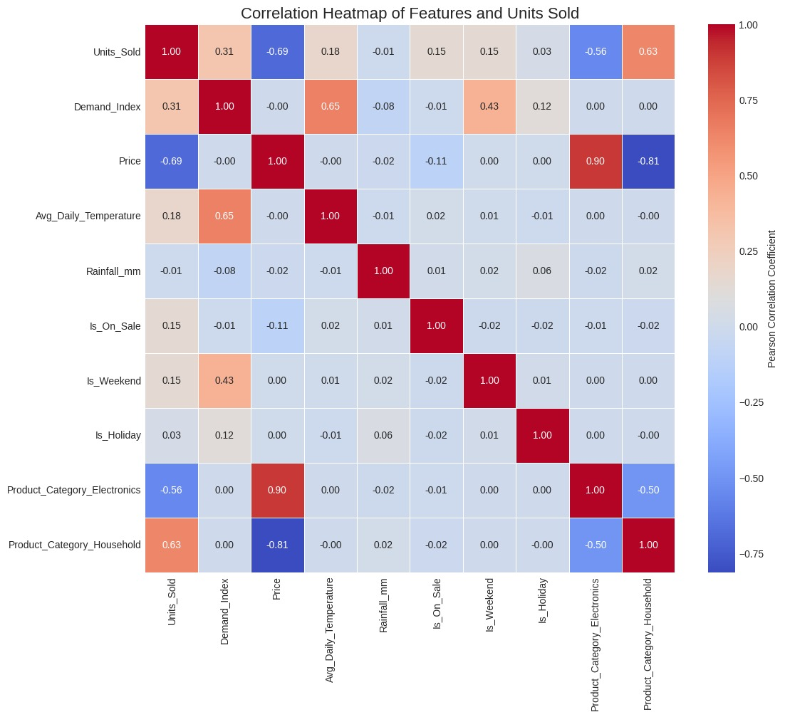

# HCL-TECH-hackathon
## Project summary
This project builds and compares time-series forecasting models to predict daily Units_Sold for multiple product categories (Clothing, Household, Electronics). It uses a simulated retail dataset that contains a target (Units_Sold) plus macro (exogenous) and category-specific features. The goal is accurate 7-day ahead forecasting for each product category using classical and ML/Deep learning approaches. See the project brief and dataset description for details.

## objectives
The primary goal of this project was to develop and compare high-accuracy time series forecasting models to predict Daily Units Sold for multiple product categories (Clothing, Household, Electronics).\
• Target Variable: Daily Units Sold of different categories. \
• Key Challenge: Forecasting multiple, highly volatile series simultaneously while incorporating 
numerous external factors (exogenous variables). 

## Key points from the data documentation (source)

This raw csv file ingested into MS Server database and then loaded that dataset from server to proceed with data preprocessing.

### Target: 
Units_Sold (daily count). 
### Macro / exogenous features (shared across categories): 
Rainfall_mm (log-transformed), Avg_Daily_Temperature, Demand_Index, Is_Holiday, Is_Weekend. 
### Category-specific features: 
Product_Category, Price, Is_On_Sale. 
### Preprocessing notes: 
1)missing value handling (ffill, interpolation)\
2)label encoding for Product_Category(0: Clothing, 1:Electronics ,2: Household)\
3)StandardScaler applied to exogenous numerical features (target left unscaled)\
4)log transform applied to rainfall.

Finally Ingested the cleaned data into the Database again.

## Model Training
### 1) LSTM
category 0:Test MAE: 5.690, RMSE: 43.828, MAPE: 8.700%\
category 1:Test MAE: 5.797, RMSE: 66.378, MAPE: 15.995%\
category 2:Test MAE: 11.596, RMSE: 209.776, MAPE: 11.936%\
S.No     &ensp;&ensp;          Date     &ensp;&ensp; &ensp;&ensp;&ensp;    0   &ensp;  &ensp; &ensp;&ensp;&ensp; &ensp;   1     &ensp; &ensp;&ensp;&ensp;&ensp;&ensp;     2   &ensp;&ensp; &ensp;&ensp;&ensp;&ensp;&ensp;   total_units\
0         &ensp;       2025-12-13 &ensp; 64.059563 &ensp; 39.325989 &ensp; 108.077087 &ensp;  211.462639\
1         &ensp;       2025-12-14  &ensp;64.051582  &ensp;45.130676 &ensp; 115.484825 &ensp;  224.667084\
2         &ensp;       2025-12-15&ensp;  64.041199&ensp;  48.390911&ensp;  120.288803  &ensp; 232.720913\
3         &ensp;       2025-12-16  &ensp;64.031914  &ensp;48.160152 &ensp; 119.907021  &ensp; 232.099087\
4         &ensp;       2025-12-17  &ensp;64.024300&ensp;  44.476101  &ensp;114.298599&ensp;   222.799000\
5          &ensp;      2025-12-18&ensp;  64.018776 &ensp; 38.297073 &ensp; 105.160355 &ensp;  207.476204\
6          &ensp;      2025-12-19 &ensp; 64.014496 &ensp; 31.517681&ensp;   95.028458 &ensp;  190.560635

### 2)Linear Regression, Random Forest, XGBoost

Feature Engineering for Machine Learning Models

Machine Learning models do not inherently understand time-series patterns, so feature engineering is required to provide temporal context.
The following features were created to help ML models learn trends, seasonality, and past dependencies:

1️⃣ Lag Features
Used to capture past sales behavior:

lag_1 → previous day's sales

lag_7 → previous week's sales

lag_14 → bi-weekly sales pattern

2️⃣ Rolling Window Feature

Used to capture smoothed trends:

ma_7 → 7-day moving average of sales

3️⃣ Calendar Features

Used to capture recurring seasonal patterns:

dayofweek → indicates weekday/weekend effects

month → captures monthly seasonality

4️⃣ Data Cleaning

Rows containing missing values generated from lag and rolling features were removed.\
model performances:

Next 14 days prediction using Random Forest regressor:

### 3)Holt winter

Next 14 days prediction:

## Conclusion
Both Holt-Winters and the Random Forest Regressor demonstrated strong forecasting performance, accurately capturing the underlying patterns in the historical sales data. These models effectively leveraged seasonality, trend components, and engineered features to produce reliable short-term forecasts.

By using the predicted units sold for the upcoming week, stores can make data-driven decisions on:

1)Optimizing inventory levels

2)Avoiding overstocking or stockouts

3)Planning procurement and logistics

4)Allocating resources more efficiently

5)Improving revenue through smarter demand planning

Overall, the forecasting pipeline provides actionable insights that help retail stores proactively manage stock, reduce operational uncertainty, and support more strategic investment decisions.

We have deployed our current best model Holt Winter using streamlit

Our model predicts 2 clear spikes in demand, corresponding to the weekends.
This shows that the time-series model has captured weekly seasonality—customers tend to purchase more during weekends, and the model has generalized this pattern into the forecast.
This insight helps retail teams plan inventory, staffing, and supply-chain operations proactively.

## Contributions
Vikram Patil: Data collection,Preprocessing,EDA,Feature Engineering\
Karthikeya: Data Collection, Model training, Continuous improvisation over approaches and model training\
Nikhil: Database connection, Model traing, Streamlit deployment 

